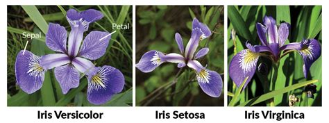
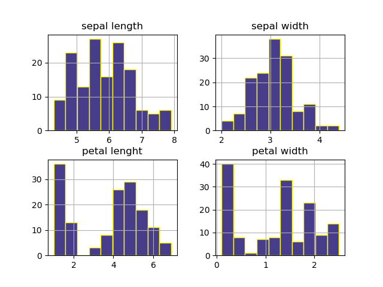

# Fisher's Iris Dataset - Analysis

## Table of contents
* [Project Description](#Project-Description)
* [Introduction](#Introduction)
* [Technologies](#Technologies)
* [Data set description](#Data-set-description)
  * [Variables-Description](#Variables-Description)
    * [Summary](#Summary)
    * [Visualisation](#Visualisation)
* [Model's predictibility](#Model's-predictibility)
* [Conclusions](#Conclusions)
* [References](#References)


---

## Project Description
This research aims to analize the Ficher's Iris Dataset. First we will perform a description of all variables, after which we will test the predictability of the data.

Each segment will have a description and code samples.

The analysis is the final project of a module in Pytohn Programming, and the final goal is to refine our skills with python as a data analysis tool.

---

## Introduction
The Iris flower data set (or Ficher's Iris data set) is a multivariable data set created by the British statistician, eigenecist, and biologist Ronald Fisher in 1936. 

Ficher was not alone in this task. Dr. Edgar Anderson, a botanist from New York, is cited as the source of the data, which was collected at the Gaspé Peninsula, in Canada.

The data set has the attributes of 150 itis flowers. The goal was to create a linear function to differentiate iris species based on the morphology of their flowers.

The publication of "The Use of Multiple Measurements in TAxonomic Problems", had tremendous success, which is the reason why it's so widely used and studied. 

However, it's interesting to mention the context in which this research was conducted. Ficher was a vocal proponent of eugenics. "One of the points of the paper (and the journal, and of Fisher's leading roe in developing biometry and biostatistics) was to propose a methodological framework to delineate desirable traits, in support of eugenics programs."("Armchair Ecology, 2020")

Iris flowers varieties:




---

## Technologies
For this project we used Python 3.7.6, and the following libraries:
``` python
import numpy as np
import matplotlib.pyplot as plt
import pandas as pd
import seaborn as sns
```

* Pandas will be used to summary the data.

* Matplotlib will create the histograms for each variable and variable combination

* With Seaborn we will display the scatterplots
---
## Data set Description

The source of the data set is :

```
http://archive.ics.uci.edu/ml/datasets/Iris
```
<br>
The data set contains 3 classes of 50 instances each, where each class refers to a type of iris plant. 

The attributes are:
* Sepal length in cm
* Sepal width in cm
* Setal length in cm
* Setal width in cm
* class:
    * Iris Setosa
    * Iris Versicolour
    * Iris Virginica

<br>
FIrst, we will read the data with:

```python
dataset = pd.read_csv("iris.data.csv")

```

We can check the number of instances for each variety with:
```python
dataset.groupby("variety").size()
```
Resulting in:
```python
|-----------------------|
| variety               |
|-----------------------|
| Iris-setosa        49 |
|-----------------------|
| Iris-versicolor    50 |
|-----------------------|
| Iris-virginica     50 |
|-----------------------|
| dtype: int64          |
|-----------------------|
```

 With the following code we can structure the attribute's names and access a sample (first instance) of the database:

```python
dataset = pd.read_csv("iris.data.csv", header=None, names=["sepal length", "sepal width", "petal lenght", "petal width", "variety"])

dataset.head(1)
```

The result: 
 ```python
|----------------------------------------------------------------------|
|    sepal length  sepal width  petal lenght  petal width      variety |
|----------------------------------------------------------------------|
| 0           5.1          3.5           1.4          0.2  Iris-setosa |
|----------------------------------------------------------------------|
```
 

---
## Variables Description

### Summary

To access a description of each variable, we will first set the indexes:

```python
setosa = dataset.loc[:49]
versicolor = dataset.loc[49:99]
virginica = dataset.loc[99:]
```
Then, we can describe them:
```python
s = setosa.describe()
ver = versicolor.describe()
vir = virginica.describe()
```

And we will save a summary of each variable grouped by variery of flower to a file:
```python
variable_summary = dataset.groupby("variety").describe()

variable_summary.to_csv("summary.txt")
# With a copy in table format in the file summary_table.txt

```


## Visualisation

With histograms we can see the distribution for each attribute:
```python
dataset.hist(color = "darkslateblue", edgecolor="yellow")

```


In both sepal lenght and sepal width we can see a distribution close to normal. However, in petal lenght and petal width, there are two different bodies of data (especially in petal lenght).


---
## Model's predictibility
---
## Conclusions
---
## References