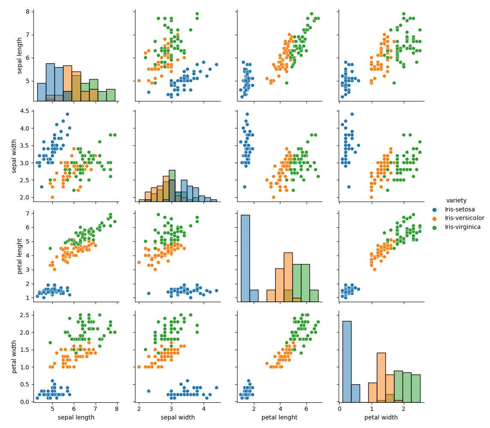

# Fisher's Iris Dataset - Analysis

## Table of contents
* [Project Description](#Project-Description)
* [Introduction](#Introduction)
* [Technologies](#Technologies)
* [Data set description](#Data-set-description)
  * [Variables-Description](#Variables-Description)
    * [Summary](#Summary)
    * [Visualisation](#Visualisation)
* [Conclusions](#Conclusions)
* [References](#References)


---

## Project Description
This research aims to analize the Ficher's Iris Dataset. First we will perform a description of all variables, after which we will test the predictability of the data.

Each segment will have a description and code samples.

The analysis is the final project of a module in Pytohn Programming, and the final goal is to refine our skills with python as a data analysis tool.

---

## Introduction
The Iris flower data set (or Ficher's Iris data set) is a multivariable data set created by the British statistician, eigenecist, and biologist Ronald Fisher in 1936. 

Ficher was not alone in this task. Dr. Edgar Anderson, a botanist from New York, is cited as the source of the data, which was collected at the Gaspé Peninsula, in Canada.

The data set has the attributes of 150 itis flowers. The goal was to create a linear function to differentiate iris species based on the morphology of their flowers.

The publication of "The Use of Multiple Measurements in TAxonomic Problems", had tremendous success, which is the reason why it's so widely used and studied. 


Iris flowers varieties:


---

## Technologies
For this project we used Python 3.7.6, and the following libraries:
``` python
import matplotlib.pyplot as plt
import pandas as pd
import seaborn as sns
```

* Pandas will be used to summary the data.

* Matplotlib will create the histograms for each variable and variable combination

* With Seaborn we will display the scatterplots
---
## Data set Description

The source of the data set is :

```
http://archive.ics.uci.edu/ml/datasets/Iris
```
<br>
The data set contains 3 classes of 50 instances each, where each class refers to a type of iris plant. 

The attributes are:
* Sepal length in cm
* Sepal width in cm
* Setal length in cm
* Setal width in cm
* class:
    * Iris Setosa
    * Iris Versicolour
    * Iris Virginica

<br>
FIrst, we will read the data with:

```python
dataset = pd.read_csv("iris.data.csv")

```

We can check the number of instances for each variety with:
```python
dataset.groupby("variety").size()
```
Resulting in:
```python
|-----------------------|
| variety               |
|-----------------------|
| Iris-setosa        49 |
|-----------------------|
| Iris-versicolor    50 |
|-----------------------|
| Iris-virginica     50 |
|-----------------------|
| dtype: int64          |
|-----------------------|
```

 With the following code we can structure the attribute's names and access a sample (first instance) of the database:

```python
dataset = pd.read_csv("iris.data.csv", header=None, names=["sepal length", "sepal width", "petal lenght", "petal width", "variety"])

dataset.head(1)
```

The result: 
 ```python
|----------------------------------------------------------------------|
|    sepal length  sepal width  petal lenght  petal width      variety |
|----------------------------------------------------------------------|
| 0           5.1          3.5           1.4          0.2  Iris-setosa |
|----------------------------------------------------------------------|
```
 

---
## Variables Description

### Summary

To access a description of each variable, we will first group the data by variety of flower:

```python
setosa = dataset[dataset["variety"] =="Iris-setosa"]
versicolor = dataset[dataset["variety"] =="Iris-versicolor"]
virginica = dataset[dataset["variety"] =="Iris-virginica"]
```
Then, we can describe them:
```python
setosa.describe()
versicolor.describe()
virginica.describe()
```


```
|-------------------------------------------------------------|
| Iris setosa:                                                |
|-------------------------------------------------------------|
|        sepal length  sepal width  petal lenght  petal width |
|-------------------------------------------------------------|
| count      50.00000    50.000000     50.000000     50.00000 |
|-------------------------------------------------------------|
| mean        5.00600     3.418000      1.464000      0.24400 |
|-------------------------------------------------------------|
| std         0.35249     0.381024      0.173511      0.10721 |
|-------------------------------------------------------------|
| min         4.30000     2.300000      1.000000      0.10000 |
|-------------------------------------------------------------|
| 25%         4.80000     3.125000      1.400000      0.20000 |
|-------------------------------------------------------------|
| 50%         5.00000     3.400000      1.500000      0.20000 |
|-------------------------------------------------------------|
| 75%         5.20000     3.675000      1.575000      0.30000 |
|-------------------------------------------------------------|
| max         5.80000     4.400000      1.900000      0.60000 |
|-------------------------------------------------------------|

```
```
|-------------------------------------------------------------|
| Iris versicolor:                                            |
|-------------------------------------------------------------|
|        sepal length  sepal width  petal lenght  petal width |
|-------------------------------------------------------------|
| count     50.000000    50.000000     50.000000    50.000000 |
|-------------------------------------------------------------|
| mean       5.936000     2.770000      4.260000     1.326000 |
|-------------------------------------------------------------|
| std        0.516171     0.313798      0.469911     0.197753 |
|-------------------------------------------------------------|
| min        4.900000     2.000000      3.000000     1.000000 |
|-------------------------------------------------------------|
| 25%        5.600000     2.525000      4.000000     1.200000 |
|-------------------------------------------------------------|
| 50%        5.900000     2.800000      4.350000     1.300000 |
|-------------------------------------------------------------|
| 75%        6.300000     3.000000      4.600000     1.500000 |
|-------------------------------------------------------------|
| max        7.000000     3.400000      5.100000     1.800000 |
|-------------------------------------------------------------|
```
```
|-------------------------------------------------------------|
| Iris virginica:                                             |
|-------------------------------------------------------------|
|        sepal length  sepal width  petal lenght  petal width |
|-------------------------------------------------------------|
| count      50.00000    50.000000     50.000000     50.00000 |
|-------------------------------------------------------------|
| mean        6.58800     2.974000      5.552000      2.02600 |
|-------------------------------------------------------------|
| std         0.63588     0.322497      0.551895      0.27465 |
|-------------------------------------------------------------|
| min         4.90000     2.200000      4.500000      1.40000 |
|-------------------------------------------------------------|
| 25%         6.22500     2.800000      5.100000      1.80000 |
|-------------------------------------------------------------|
| 50%         6.50000     3.000000      5.550000      2.00000 |
|-------------------------------------------------------------|
| 75%         6.90000     3.175000      5.875000      2.30000 |
|-------------------------------------------------------------|
| max         7.90000     3.800000      6.900000      2.50000 |
|-------------------------------------------------------------|
```
```
```
And we will save a summary of each variable grouped by variery of flower to a file:
```python
variable_summary = dataset.groupby("variety").describe()

variable_summary.to_csv("summary.txt")
# With a copy in table format in the file summary_table.txt

```


## Visualisation

With histograms we can see the distribution for each attribute:
```python
dataset.hist(color = "darkslateblue", edgecolor="yellow")

```


<br>
And the scatter plot matrix will reveal the differences between the different varieties:

```
a = sns.PairGrid(dataset, hue="variety")
a.map_diag(sns.histplot)
a.map_offdiag(sns.scatterplot)
a.add_legend()
plt.savefig(fname="scatterplot.png")
```



We can see that petal lenght and petal width are the attributes that most efficiently differenciate the Iris-Setosa variety.

Cheking the data from the description, we can see these differences between all varieties:

  * In petal lenght, setosa has a mean of 1.464, while versicolor and virginica have 4.26 and 5.552, respectively.
  * In petal width, the values are 0.244 for setosa, 1.326 for versicolor and 2.02600 for virginica.


---
## Conclusions
We can conclude that the Fisher's data set is very useful for the process of learning python and data analysis. It's clear and manageable data makes it a good starting point, but we must enphazise the importance of all the analysis available in the community (hundreds of examples and different ways of learning with this dataset).

This process has shown us how useful python can be. There are, of course, more complete analysis, ones that we couldn't understand. But with under 20 lines of code, it's possible to generate a simple study of the data that can lead future and deeper analysis.
 
 
---
## References

AdrianDonohoe. “AdrianDonohoe/Pands-Project.” GitHub, 2021, github.com/AdrianDonohoe/pands-project/blob/master/README.md. Accessed 2 Apr. 2021.

Amit Arora. “Plot Histogram with Specific Color, Edge Color and Line Width.” Python Programming, Pythonprogramming, 19 Nov. 2018, www.pythonprogramming.in/plot-histogram-with-specific-color-edge-color-and-line-width.html. Accessed 2 Apr. 2021.---.


 “IRIS Dataset Analysis (Python).” Ritvik Raj, Ritvik Raj, 28 June 2017, rajritvikblog.wordpress.com/2017/06/29/iris-dataset-analysis-python/. Accessed 2 Apr. 2021.
 
 
 KHibma. “Modify Output from Python Pandas Describe.” Stack Overflow, 1 Oct. 2013, stackoverflow.com/questions/19124148/modify-output-from-python-pandas-describe. Accessed 2 Apr. 2021.
 
 killfoley. “Killfoley/Pands-Project.” GitHub, 29 Apr. 2020, github.com/killfoley/pands-project/blob/master/README.md. Accessed 2 Apr. 2021.
 
 Oluwasogo Oluwafemi Ogundowole. “Basic Analysis of the Iris Data Set Using Python - CodebagNG - Medium.” Medium, CodebagNG, 31 Oct. 2017, medium.com/codebagng/basic-analysis-of-the-iris-data-set-using-python-2995618a6342. Accessed 2 Apr. 2021.---. 
 
 “Pandas.DataFrame.loc — Pandas 1.2.3 Documentation.” Pydata.org, 2021, pandas.pydata.org/pandas-docs/stable/reference/api/pandas.DataFrame.loc.html. Accessed 2 Apr. 2021.
 
 “Scatterplot Matrix — Seaborn 0.11.1 Documentation.” Pydata.org, 2012, seaborn.pydata.org/examples/scatterplot_matrix.html. Accessed 2 Apr. 2021.

 Sulav Ojha. “Exploratory Data Analysis on IRIS DATASET - Sulav Ojha - Medium.” Medium, Medium, 15 July 2019, medium.com/@sulavojha11/exploratory-data-analysis-on-iris-dataset-84832e519040. Accessed 19 Apr. 2021.
 
 Traversy Media. “Markdown Crash Course.” YouTube, 23 Mar. 2018, www.youtube.com/watch?v=HUBNt18RFbo&t=851s. Accessed 2 Apr. 2021.
